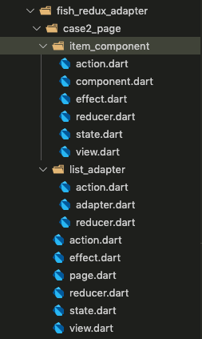

# BLoC - ScopedModel - Redux - fishRedux - provider - Comparison

## 前言

flutter 使用了与很多前端开发框架相同的开发思想，都是声明式编程框架：


其中应用当前状态与应用的当前 UI 展示一一对应；状态改变时将会导致页面 UI 的重绘；那么管理状态就成了 flutter app 最为重要最为频繁的操作之一，首先看看 flutter 自身的状态管理：

#### 内部状态

| state 来源      | 改变方式      |
| --------------- | ------------- |
| StatefulWidget  | setState()    |
| StatefulBuilder | subSetState() |

#### 外部环境状态

外部环境状态指的是当前状态是通过外部传入的

| state 来源    | 改变方式                                                   |
| ------------- | ---------------------------------------------------------- |
| inheritWidget | `AnimationBuilder` 或者 setState                           |
| Stream        | Stream 改变时，依赖于 Stream 的 StreamBuilder 将会重新构建 |

除了单个 widget 的状态管理以外，还涉及到不同的 widget 之间状态的共享，状态的传递，当一个应用状态越来越多的时候，状态的耦合度会越来越大，相互交错，难以维护，为了解决这个问题，数据流解决方案应运而生。

目前 flutter 生态比较流行的数据流解决方案有：

-   `BLoC`： 流式响应式编程数据流
-   `ScopedModel`： 典型的基于`InheritedWidget`将 数据 **model** 扩展共享至其子代
-   `Redux`：也就是 flutter-redux，经典的 redux 解决方案
-   `Provider` 谷歌推荐的数据流方案
-   `Fish-redux`：阿里咸鱼技术数据流框架

### 本文目的：

-   让读者熟悉各个数据流方案的基本设计原理，会使用没种方案的基本用法；
-   通过一个详细的例子，能让读者对各个方案的优缺点有一个初步的认识，在实际业务种知道**用那种**，以及**怎么用**

## 用法及原理介绍

### Redux

Redux 是一个数据流管理框架，用与控制整个应用的数据流向与状态改变，其设计的主要原则有：

-   单一数据源，一个应用只存在一个用于储存数据的`store`，这点也是 redux 与其他方案的一个很大的区别；
-   state 的状态是只读的，改变 state 的唯一方式就是 `dispatch(action)`
-   `dispatch(action)` 首先会分配到**MiddleWare**里面，做一些其他操作，**MiddleWare**之后进入 `reducer` 进行改变`state`
-   整个改变 state 的过程都是纯函数，同一输入同一输出

> 下面简单介绍`redux`各个知识点，详细参见官方文档: [redux](https://www.redux.org.cn/)

#### action

`action`是一个描述如何改变 state 的载体，由标识符与具体数据组成，比如点击一个按钮，让一个初始值为 0 的状态改变为 1，那么对应的`action`应该是：

```dart
{
  type: ADD_TODO,
  payload: 1
}
```

#### reducer

`reducer` 接收旧的`state`和指定标识符的`action`为参数， 返回新的`state`;`(oldState, action) => newState`;这也是改变`state`唯一的方式；

> 这里需要注意引用指针问题，一般`state`为引用类型数据，改变某些属性值并不能生成新的`state`, 一般我们会对`state`进行克隆。
> 这里还需注意因为克隆导致改变`state`其中某一个数据，就要重新计算整个`state`数据, 从而造成不必要的复杂度计算，为了解决这个问题，我们一般将
> `Reselect`库，只改变相关联数据，其他不相关数据直接读取。其实现思想也是运用了纯函数，将之前的函数运行结果缓存一份，下次比较参数，若相等则读取缓存，若不同，重新计算

```dart
int counterReducer(int state, dynamic action) {
  if (action == ADD_TODO) {
    return state + 1;
  }

  return state;
}
```

至此，原汁原味的 redux 改变 `state` 的流程就走完了，用过成熟第三 redux 衍生库(fish-redux、redux-dva、redux-saga)的读者肯定会发现其中少了一个环节`effect`,
`effect`其实就是`redux`里面一个用于处理异步的中间件**MiddleWare**。下面我们仔细看看 redux **MiddleWare**

#### MiddleWare

redux 中间件见解了 Koa 框架洋葱模型中间件，在`dispatch(action)`之后，调用 reducer 之前，依次遍历调用 MiddleWares 数组(`next(action)`)，中途可以执行任何异步操作(记录日志，API 请求等)，
最后再进入 reducer 改变状态；下面是中间件调用过程的雏形(js)：

```js
function applyMiddleware(store, middlewares) {
    middlewares = middlewares.slice();
    middlewares.reverse();

    let dispatch = store.dispatch;
    middlewares.forEach(middleware => (dispatch = middleware(store)(dispatch)));

    return Object.assign({}, store, { dispatch });
}
```

因为原生 redux 统一的中间件调用规则，那么任何 redux 中间件都将是一个接收 3 个参数的柯里化函数：依次是`store => next => action => {}` (fish-redux/case2/page),
那么编写一个简单的处理异步的**MiddleWare**将非常简单：

```js
function createThunkMiddleware(extraArgument) {
    return ({ dispatch, getState }) => next => action => {
        if (typeof action === "function") {
            return action(dispatch, getState, extraArgument);
        }

        return next(action);
    };
}
```

这也是赫赫有名的`redux-thunk`的源码，十几行代码尽然有一万多 Star，惊呆了！然后我们再看`effect`就非常简单了：

#### effect

effect 的始祖正是强大的 redux 中间件`redux-saga`, 它是一堆异步操作的`Map`集合，也就是形成了`action.type`与异步操作的映射， 将`dispatch`过来的`action`通过 action 的标识符与固定的异步函数相关联：

`dispatch(action(type: 'A'))`------> `effectMiddleWare({A: (){ 执行异步函数……}})` ----->
`reducer(oldState, action)`------> `newState`


熟悉了 redux 后我们看 redux 在 flutter 应用上的两个数据流解决方案：**flutter-redux**与**fish-redux**:

### flutter-redux

flutter-redux 是 flutter 版本的 redux, 完全保留了原滋原味的 redux，当然前面提到的几点性能优化的地方，包括中间件的编写，也可以由开发人员自由发挥。
由于 redux 三大原则之一：单一数据源，整个 app 只有一个 store，默认情况下，改变某一个子组件状态，就要重新生成一个新的 store 才会刷新页面，当然，这也会造成整个页面的重新渲染。为了解决这个必须解决的矛盾，就要对 store 进行细颗粒度的分割，某以页面或组件只依赖某一个子 state;
开始介绍其简单的默认用法：

#### 提供者 StoreProvider

> **StoreProvider** 做为列表唯一数据源 `store`提供者，只要`store`改变，后续依赖子组件都会重新构建

```dart
     Widget build(BuildContext context) {
        return StoreProvider<ApplicationState>(
        store: applicationStore,
        child: MaterialApp(
                home: ReduxPage(),
            ),
        );
    }
```

#### 接收者 StoreConnector

> **StoreConnector** 链接`store`，取出所要用到的数据

```dart
   StoreConnector<ApplicationState,ReduxWidgetButtonViewModel>(
        converter: (Store<ApplicationState> store) {
    return ReduxWidgetButtonViewModel(
        isActive: store.state.panelsList[panelIndex].isTimerOn
    }, builder: (BuildContext context,
            ReduxWidgetButtonViewModel model) {
    return RaisedButton(
        child: Text(model.isActive ? 'Stop' : 'Start'));
    }),
```

> 如你所见，原滋原味的 redux;

### fish-redux

如果说 flutter-redux 只是一个解决数据流的第三方依赖库的话，fish-redux 才是真正意义上的应用级数据流框架，它直接改变了应用的编码架构，范式结构。并且在上面提到的各种性能优化 fish-redux 也几乎做到了最优(state 数据层计算方面), 在便于组件拆分和长列表渲染方面也做了相关优化(dependencies)。fish-redux 是阿里闲鱼解决方案，官方文档依旧是很难不懂，对于初学者学习有一定难度，不过 fish-redux 并没有破坏原有 redux 结构，整体编码思想还是跟 redux 保持一直。只是在其基础上结合 flutter 生命周期特性等做了扩展和优化，下面简单介绍其基础用法和相关特性：

> vscode 开发者可以下载插件**fish-redux-template**，目录点击右键直接创建对应模版，非常方便。
> 最新版 fish-redux 是 v0.3.1,新旧版本用法差异比较大，我们以最新版为例！

简单介绍展示业务层代码（接入 app 的入口代码参照(copy)官方示例）。

#### page.dart

page 是页面级别的根文件, 继承 fish 父类 Page, 直接调用父类构造函数，组合了 redux 整个流程需要的元素：

-   `initState` 对应 redux 初始化 state
-   `effect` 对应 redux 异步中间件，调用在`dispatch(action)`之后`reducer`之前用于处理异步操作流程
-   `reducer` 对应 redux reducer 流程
-   `view` 对应页面 UI 展示的 Widget
-   `dependencies` 主要发挥了两个方面的作用：

    1. `slots`: 组件拆分，比如有各一个 common 级组件需要抽离出来,当然这里的组件也必须是 fish-components, 其中除了 common 组件以外还有一个：
       用于在父组件将对应 state 传给 common 组件的连接器**Connector**，Connector 里面起了一个很重要的优化作用(mixin reselect)，用于缓存不可变数据，也就是对应 redux 里面的 reselect；
    2. `adapter`: 专注与处理长列表性能优化, 其中优化的功能点以及所起到的作用有：

        - 拆分 store, 使每个 item 只依赖与自己的 state(
            ```dart
            /// 获取列表item数据
            @override
            Object getItemData(int index) => widgets[index];
            ```
        - 优化 big-cell 性能

        > 针对这两点那么就大致可以知道什么时候该用`adapter`： 1. 列表 item 需要保持私有 state 状态， 2. 列表中存在 big-cell;

-   `middleware`: 对应 redux 中间件，其用法和原生 redux 如出一辙
-   `shouldUpdate`: 更细粒度的控制某个 item 是否更新
-   `wrapper`: item 的高阶组件函数，非常方便！
    ……
    还有很多，这里就不一一列出了，可以说你想得到的和你没想到的，fish 帮我们做了更多。

```dart
class Case2Page extends Page<Case2State, Map<String, dynamic>> {
    Case2Page()
        : super(
            initState: initState,
            effect: buildEffect(),
            reducer: buildReducer(),
            view: buildView,
            dependencies: Dependencies<Case2State>(
                adapter: NoneConn<Case2State>() + Case2ListAdapter(),
                //slots: <String, Dependent<PageState>>{
                    //'report': ReportConnector() + ReportComponent()
                //}),
            ),
            middleware: <Middleware<Case2State>>[],
            shouldUpdate: (ItemState old, ItemState now) {
              return old != now;
            },
            filter: (ItemState state, action) {
              return action.type == 'some action';
            },
            wrapper: (Widget w) {
              return Container(
                margin: EdgeInsets.only(top: 20),
                child: w,
                color: Colors.red,
              );
            });
        );
}
```

#### action.dart reducer.dart 没任何改变，不在赘述

#### effect.dart

对应 page 里面的 effect, 这里除了拦截接收到自定义 action 做一些异步操作以外，还拦截了 flutter 整个生命周期钩子，相当于生命周期钩子函数，实际业务中用起来非常方便,
值得注意的是，除了 flutter statefulWidget 生命周期以外，fish 还额外注入了三个常用的额外生命周期：

-   `Lifecycle.appear`: 列表组件在视图中显示时的触发
-   `Lifecycle.disappear`: 列表组件在视图中隐藏时的触发
-   `Lifecycle.didChangeAppLifecycleState`: 继承 AppLifecycleState， 在切换前台后台时触发

```dart
Effect<ItemState> buildEffect() {
    return combineEffects(<Object, Effect<ItemState>>{
        /// initState 生命周期对应触发 _init函数
        Lifecycle.initState: _init
        /// 接收到 ItemAction.startStopPanelAction 类型action, 触发异步操作函数 _startStopPanelAction
        ItemAction.startStopPanelAction: _startStopPanelAction
    });
}
```

#### state.dart

state 有两种，一种是非关联 adaptor 的:

```dart
class ItemState implements Cloneable<ItemState> {
    int index;

    /// 实现了 state 的 clone
    @override
    ItemState clone() {
        return ItemState()
        ..index = index
    }
    @override
    String toString() {
        return 'ItemState{index: $index}';
    }
}
//ItemState initState(Map<String, dynamic> args) {
//  return ItemState()..index = [];
//}
```

一种是关联 adaptor(要将数据传递给 adaptor)：

```dart
class Case2State extends MutableSource implements Cloneable<Case2State> {
    List<ItemState> widgets;

    @override
    Case2State clone() {
        return Case2State()..widgets = widgets;
    }

    /// 获取列表item数据
    @override
    Object getItemData(int index) => widgets[index];

    /// item链接adaptor池的唯一字符
    @override
    String getItemType(int index) => 'item';

    /// 列表长度
    @override
    int get itemCount => widgets?.length ?? 0;

    /// 设置列表item数据
    @override
    void setItemData(int index, Object data) => widgets[index] = data;
}

Case2State initState(Map<String, dynamic> args) {
  return Case2State()..widgets = [];
}
```

### BLoC

BLoC(Business Logic Component) 是一种编程模式，由 google 在 2018 年 1 月首次提出，它甚至不需要任何外部库或程序包，因为它仅依赖于 Streams 的使用。但是，为了获得更友好的功能，通常将其与 RxDart 软件包结合使用。

flutter 里面的 BLoC 的实现依赖于 dart API **Stream**

#### 关于 stream

stream 可以形象的理解为：考虑一个具有 2 个末端的管道，只有一个管道允许在其中插入一些东西。当您将某些东西插入管道时，它会在管道内流动并从另一端流出。

在 flutter 里,

-   这个管道就是流（BLoC）
-   控制这根管道的流入流出，我们常常用 StreamController
-   为了将某些内容插入**Stream**中，**StreamController**公开了可通过接收器属性访问的 api`Sink`
-   为了将某些内容流出**Stream**中，**StreamController**公开了可通过接收器属性访问的 api`Stream`


可以看出 Widget 将事件发送至 BLoC，BLoC 以 stream 的形式通知 Widget，整个 BLoC 业务逻辑保持绝对独立，与 Widget 没任何关联。得益于 BLoC 与 Ui 的完全分离，
实际上，BLoC 模式最初是为了允许重用完全相同的代码而与平台无关的：Web 应用程序，移动应用程序，后端。

一个简单的 Increment 功能的 BLoC 例子：

定义加一功能的 Bloc 模型

```dart
class IncrementBloc implements BlocBase {
  int _counter;

  StreamController<int> _counterController = StreamController<int>();
  StreamSink<int> get _inAdd => _counterController.sink;
  Stream<int> get outCounter => _counterController.stream;


  //NOTE: 动作action Controller
  StreamController _actionController = StreamController();
  StreamSink get incrementCounter => _actionController.sink;

  IncrementBloc() {
    _counter = 0;
    _actionController.stream.listen(_handleLogic);
  }

  void dispose() {
    _actionController.close();
    _counterController.close();
  }

  void _handleLogic(data) {
    _counter = _counter + 1;
    _inAdd.add(_counter);
  }
}
```

然后将 BLoC 用于任何页面：

```dart
class BlocAddOneApplication extends StatelessWidget {
  @override
  Widget build(BuildContext context) {
    return new MaterialApp(
      title: 'Streams Demo',
      theme: new ThemeData(
        primarySwatch: Colors.blue,
      ),
      home: BlocProvider<IncrementBloc>( // common > bloc_provider
        bloc: IncrementBloc(),
        child: CounterPage(),
      ),
    );
  }
}
```

在业务页面只需发出对应的动作即可，具体实现的业务逻辑与页面毫无关系，UI 与业务逻辑高度分离；其来的优点显而易见：

-   便于逻辑测试，这里只测试 BLoC 逻辑即可，与页面无关；
-   高度独立的逻辑独立，不与任何 UI 耦合，带来更好的逻辑扩展
-   可以将 BLoC 用于任何相同功能逻辑的页面，比如常见的下拉刷新，上拉下载业务

```dart
class CounterPage extends StatelessWidget {
  @override
  Widget build(BuildContext context) {
    final IncrementBloc bloc = BlocProvider.of<IncrementBloc>(context);
    return Scaffold(
      appBar: AppBar(
          title: Text('BLoC version of the Counter'),
          brightness: Brightness.dark),
      body: Center(
        child: StreamBuilder<int>(
            stream: bloc.outCounter,
            initialData: 0,
            builder: (BuildContext context, AsyncSnapshot<int> snapshot) {
              return Text('${snapshot.data} times');
            }),
      ),
      floatingActionButton: FloatingActionButton(
        child: const Icon(Icons.add),
        onPressed: () {
          bloc.incrementCounter.add(null);  //HACK: 发出动作，我要加一！！！至于如何加一以及加一过程中经历了什么，我毫不关心
        },
      ),
    );
  }
}
```


### Provider 与 Scoped_model

之所以把这两个放在一起介绍，是因为实现是想基本一致，只是提供的 api 不同，他们的状态的共享都的实现都是分为两步完成：

#### 1. 一个提供恒定共享数据的 inheritedWidget

-   子 widget 通过调用 `context` api (`dependOnInheritedWidgetOfExactType`) 获取 inheritedWidget 的最新 state；
-   依赖`inheritedWidget` state 的子 widget 将在每次 state 数据变化时，触发`updateShouldNotify`，从而通知子组件是否更新数据，但不会重新构建；

```dart
class ShareDataWidget extends InheritedWidget {
  ShareDataWidget({@required this.data, Widget child}) : super(child: child);

  // NODE: data发生改变时，将重新构建上下文，所依赖的子widget会接收到最新的值；
  final int data;

  static ShareDataWidget of(BuildContext context) {
    return context.dependOnInheritedWidgetOfExactType();
  }

  @override
  bool updateShouldNotify(ShareDataWidget old) {
    return old.data != data;
  }
}
```

#### 通知 Widget 刷新

他们都是通过 flutter 自身提供的`Listenable`通知刷新，其整个通知重新构建的过程为：

-   继承至`Listenable`的 model 数据改变时，自动将 update 函数（注：能引起页面重构的函数）成员注入到 listener list;
-   紧接着调用 notifyListeners 通知刷新，也就是立即触发 update 函数，使页面重新渲染

当然除了自己构建 update 函数,也可以直接使用`AnimationBuilder`（其实其参数`animation`也是个`Listenable`），这也是除了 setState，能让页面重新渲染的另一种方式。

```dart
// NOTE: 本质上 ChangeNotifier 只做了一件事：model改变时添加listener, 然后model调用notifyListeners触发更新函数update，也就是setState
class _ChangeNotifierProviderState<T extends ChangeNotifier>
    extends State<ChangeNotifierProvider<T>> {
  void update() {
    //如果数据发生变化（model类调用了notifyListeners），重新构建InheritedProvider
    setState(() => {});
  }

  @override
  void didUpdateWidget(ChangeNotifierProvider<T> oldWidget) {
    //当Provider更新时，如果新旧数据不"=="，则解绑旧数据监听，同时添加新数据监听
    if (widget.data != oldWidget.data) {
      oldWidget.data.removeListener(update);
      widget.data.addListener(update); // model 调用add方法时添加listener
    }
    super.didUpdateWidget(oldWidget);
  }

  ……
}
```


原理过后我们实现一个简单 Increment:

首先是 model 层

```dart
class IncrementModel extends ChangeNotifier {
  int counter = 0;

  void add() {
    counter++;
    // 通知监听器（订阅者），触发listener，也就是调用[update]函数，更新状态。
    notifyListeners();
  }
}
```

然后创建共享数据：

```dart
class InheritedProvider<T> extends InheritedWidget {
  InheritedProvider({@required this.data, Widget child}) : super(child: child);

  final T data;

  static T of<T>(BuildContext context) {
    InheritedProvider<T> provider =
        context.dependOnInheritedWidgetOfExactType();
    return provider.data;
  }

  @override
  bool updateShouldNotify(InheritedProvider<T> old) {
    //在此简单返回true，则每次更新都会调用依赖其的子孙节点的`didChangeDependencies`。
    return true;
  }
}
```

app 顶层提供数据,这里以`AnimatedBuilder`重新渲染方式：

```dart
class MyAnimationProviderApp extends StatelessWidget {
  @override
  Widget build(BuildContext context) {
    final CartModel _cartModel = CartModel();
    return new MaterialApp(
      home: Scaffold(
        appBar: AppBar(
          title: Text('animationBuilder version chart'),
        ),
        body: Container(
            child: AnimatedBuilder(
          animation: _cartModel,
          builder: (BuildContext context, Widget child) {
            return InheritedProvider<CartModel>(
              data: _cartModel,
              child: MyProviderRoute(),
            );
          },
        )),
      ),
    );
  }
}
```

任何业务层的使用 ：

```dart
class _ProviderRouteState extends State<MyProviderRoute> {
  @override
  Widget build(BuildContext context) {
    var cart = InheritedProvider.of<CartModel>(context);
    return Center(
      child: Builder(builder: (context) {
        return Column(
          children: <Widget>[
            Builder(builder: (context) {
              return Text("Times: ${cart.counter}");
            }),
            Builder(builder: (context) {
              return RaisedButton(
                child: Text("添加商品"),
                onPressed: () {
                  cart.add();
                },
              );
            }),
          ],
        );
      }),
    );
  }
}
```

## 对比评测

### 先看一下 github star，这里也往往代表着生态的活跃度，以及大众的选择

|             | flutter-redux | fish-redux | rxdart(BLoC) | provider | scoped-model |
| ----------- | ------------- | ---------- | ------------ | -------- | ------------ |
| github star | 1100+         | 5900+      | 2200+        | 1800+    | 659          |

### 然后我们基于实现相同的一个例子，然后从以下几个维度进行对比评测：


#### 文件数量

|          | flutter-redux | fish-redux                                 | rxdart(BLoC) | provider | scoped-model |
| -------- | ------------- | ------------------------------------------ | ------------ | -------- | ------------ |
| 文件截图 | 1100+         |  | 2200+        | 1800+    | 659          |
| 数量     | 1100+         | 15+                                        | 2200+        | 1800+    | 659          |
